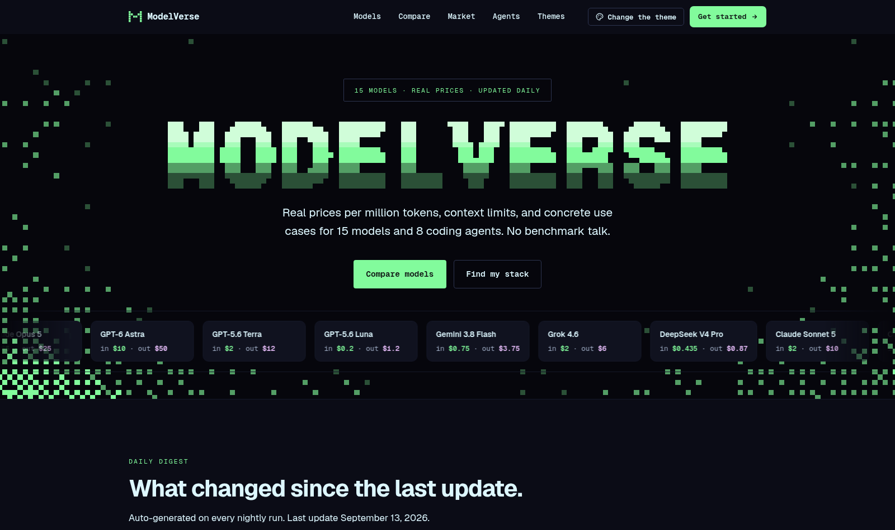
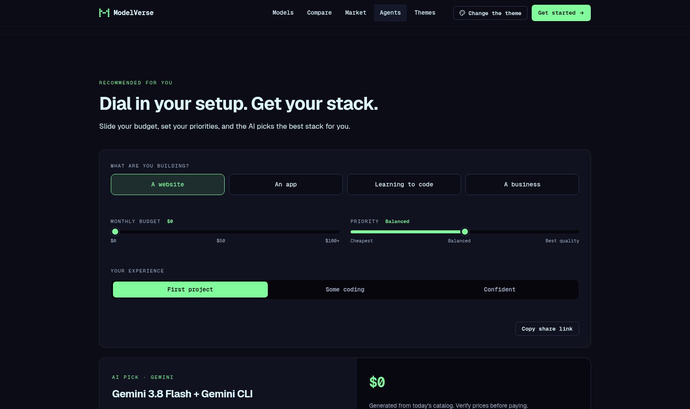

# ModelVerse

The AI model market, finally makes sense.

**[modelverse-app.pages.dev](https://modelverse-app.pages.dev)**



A single-page directory that tracks AI models, coding agents, and prices for
developers who vibe code. Everything refreshes nightly.

## Features

- **15 tracked models** — live prices, cache prices, context limits, and
  concrete "use for / skip for" notes
- **Market table** — tracked models merged with every release from 11 labs in
  the last 120 days
- **AI picks** — cheapest, best value, best for coding — re-analyzed nightly
- **Daily digest** — price changes, new releases, and pick changes since the
  last update
- **Compare** — up to three models side by side
- **Stack recommender** — Gemini picks a stack from your budget, priorities,
  and experience, with a rule-based fallback
- **10 themes** — press `T` anywhere to cycle
- **Pixel hero** — animated canvas field ported from omarchy.org



## Stack

Astro · Cloudflare Pages · [models.dev](https://models.dev) · Gemini

## Run locally

```bash
npm install
npm run dev
```

For AI features locally, create `.dev.vars` with a free
[Gemini key](https://aistudio.google.com/apikey):

```
GEMINI_API_KEY=your_key_here
```

## Update data

```bash
npm run update-prices   # prices and new releases from models.dev
npm run analyze         # AI picks
```

The nightly GitHub Action runs both, commits the results, builds, and deploys.

## Deploy

Every push to `main` builds and deploys to Cloudflare Pages. Required repo
secrets:

| Secret | Purpose |
| --- | --- |
| `GEMINI_API_KEY` | AI picks and recommender |
| `CLOUDFLARE_API_TOKEN` | Pages deploy |
| `CLOUDFLARE_ACCOUNT_ID` | Cloudflare account |

## Structure

```
src/
├── components/   Astro UI (one file per section in components/sections/)
├── data/         editorial content plus generated JSON
├── lib/          catalog, formatting, Gemini client
├── scripts/      browser modules (quiz, compare, filters, hero field)
└── styles/       themes, base, components, responsive
functions/        /api/recommend Pages Function
scripts/          nightly update and analysis jobs
```

## Credits

Design inspired by [omarchy.org](https://omarchy.org). Pricing from
[models.dev](https://models.dev).
